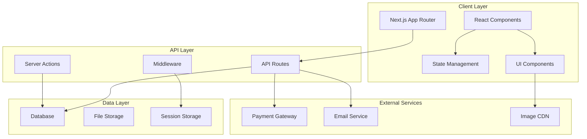

# Design Document

## Overview

The African Food Ordering Platform is a comprehensive web application built with Next.js 16 (App Router), React 19, and TypeScript. The platform serves authentic West African cuisine through a modern, responsive interface that supports both customer ordering and administrative management. The architecture emphasizes performance, scalability, and maintainability while providing an exceptional user experience across all devices.

The system is designed with a component-based architecture using shadcn/ui components, Tailwind CSS for styling, and a robust state management solution. The platform supports real-time order tracking, dynamic pricing, meal customization, and comprehensive admin tools for managing menus, orders, and users.

## Architecture

### High-Level Architecture



### Technology Stack

**Frontend Framework:**

- Next.js 16.1.1 with App Router for file-system based routing and server-side rendering
- React 19.2.3 with React Compiler for optimized performance
- TypeScript 5 for type safety and developer experience

**Styling and UI:**

- Tailwind CSS 4 for utility-first styling with custom design system
- shadcn/ui components for consistent, accessible UI elements
- Radix UI primitives for complex interactive components
- Lucide React for consistent iconography

**State Management:**

- Zustand for lightweight, scalable state management
- React Query (TanStack Query) for server state management and caching
- Local storage persistence for cart and user preferences

**Development Tools:**

- ESLint 9 for code quality and consistency
- Prettier for code formatting
- Husky for git hooks and pre-commit validation

## Components and Interfaces

### Core Data Models

```typescript
// User and Authentication Models
interface User {
  id: string;
  email: string;
  name: string;
  phone?: string;
  role: 'customer' | 'admin';
  addresses: Address[];
  createdAt: Date;
  updatedAt: Date;
}

interface Address {
  id: string;
  street: string;
  unit?: string;
  city: string;
  province: string;
  postalCode: string;
  isDefault: boolean;
}

// Menu and Product Models
interface MenuItem {
  id: string;
  name: string;
  description: string;
  basePrice: number;
  category: MenuCategory;
  image: string;
  status: 'active' | 'inactive' | 'sold_out' | 'low_stock';
  customizations: Customization[];
  nutritionalInfo?: NutritionalInfo;
  tags: string[];
  createdAt: Date;
  updatedAt: Date;
}

interface MenuCategory {
  id: string;
  name: string;
  description: string;
  displayOrder: number;
  isActive: boolean;
}

interface Customization {
  id: string;
  name: string;
  type: 'radio' | 'checkbox' | 'text';
  options: CustomizationOption[];
  required: boolean;
  maxSelections?: number;
}

interface CustomizationOption {
  id: string;
  name: string;
  priceModifier: number;
  isAvailable: boolean;
}

// Package Models
interface Package {
  id: string;
  name: string;
  description: string;
  type: 'daily' | 'weekly' | 'monthly';
  price: number;
  includedItems: PackageItem[];
  image: string;
  isActive: boolean;
  features: string[];
}

interface PackageItem {
  menuItemId: string;
  quantity: number;
  includedCustomizations: string[];
}

// Cart and Order Models
interface CartItem {
  id: string;
  menuItemId: string;
  quantity: number;
  selectedCustomizations: SelectedCustomization[];
  specialInstructions?: string;
  unitPrice: number;
  totalPrice: number;
}

interface SelectedCustomization {
  customizationId: string;
  optionIds: string[];
  textValue?: string;
}

interface Order {
  id: string;
  orderNumber: string;
  customerId: string;
  items: OrderItem[];
  subtotal: number;
  tax: number;
  deliveryFee: number;
  tip: number;
  total: number;
  status: OrderStatus;
  deliveryType: 'delivery' | 'pickup';
  deliveryAddress?: Address;
  scheduledFor?: Date;
  estimatedDelivery?: Date;
  paymentStatus: PaymentStatus;
  specialInstructions?: string;
  createdAt: Date;
  updatedAt: Date;
}

interface OrderItem {
  id: string;
  menuItemId: string;
  quantity: number;
  unitPrice: number;
  customizations: SelectedCustomization[];
  specialInstructions?: string;
  totalPrice: number;
}

type OrderStatus =
  | 'pending'
  | 'confirmed'
  | 'preparing'
  | 'ready'
  | 'out_for_delivery'
  | 'delivered'
  | 'cancelled';

type PaymentStatus =
  | 'pending'
  | 'processing'
  | 'completed'
  | 'failed'
  | 'refunded';
```

### Component Architecture

**Page Components (Server Components):**

- `HomePage` - Hero section, featured dishes, packages preview
- `MenuPage` - Menu browsing with filtering and search
- `CartPage` - Cart management and order review
- `CheckoutPage` - Multi-step checkout process
- `OrderConfirmationPage` - Order success and tracking
- `AdminDashboardPage` - Admin overview and metrics
- `AdminMenuPage` - Menu management interface
- `AdminOrdersPage` - Order management interface
- `AdminUsersPage` - User management interface

**Client Components:**

- `MealCustomizationModal` - Interactive meal customization
- `CartSidebar` - Sliding cart panel
- `SearchBar` - Real-time menu search
- `FilterPanel` - Menu filtering controls
- `OrderTracker` - Real-time order status updates
- `PriceCalculator` - Dynamic price calculations
- `ImageUploader` - Admin image management
- `DataTable` - Reusable admin data tables

**Shared UI Components:**

- `Button` - Consistent button styling with variants
- `Card` - Content containers with consistent styling
- `Modal` - Accessible modal dialogs
- `Form` - Form components with validation
- `Badge` - Status indicators and tags
- `Skeleton` - Loading state placeholders

### State Management Architecture

```typescript
// Cart Store (Zustand)
interface CartStore {
  items: CartItem[];
  isOpen: boolean;
  addItem: (item: CartItem) => void;
  removeItem: (itemId: string) => void;
  updateQuantity: (itemId: string, quantity: number) => void;
  updateCustomizations: (
    itemId: string,
    customizations: SelectedCustomization[]
  ) => void;
  clearCart: () => void;
  toggleCart: () => void;
  getTotalItems: () => number;
  getSubtotal: () => number;
  getTotal: () => number;
}

// User Store (Zustand)
interface UserStore {
  user: User | null;
  isAuthenticated: boolean;
  isLoading: boolean;
  login: (email: string, password: string) => Promise<void>;
  logout: () => void;
  updateProfile: (updates: Partial<User>) => Promise<void>;
  addAddress: (address: Omit<Address, 'id'>) => Promise<void>;
  setDefaultAddress: (addressId: string) => Promise<void>;
}

// Admin Store (Zustand)
interface AdminStore {
  selectedOrders: string[];
  filters: AdminFilters;
  setFilters: (filters: Partial<AdminFilters>) => void;
  selectOrder: (orderId: string) => void;
  deselectOrder: (orderId: string) => void;
  selectAllOrders: (orderIds: string[]) => void;
  clearSelection: () => void;
  bulkUpdateStatus: (status: OrderStatus) => Promise<void>;
}
```

## Data Models

### Database Schema Design

The application uses a relational database structure optimized for food ordering operations:

**Users Table:**

- Primary key: `id` (UUID)
- Unique constraints: `email`
- Indexes: `email`, `created_at`
- Relationships: One-to-many with `addresses`, `orders`

**Menu Items Table:**

- Primary key: `id` (UUID)
- Foreign keys: `category_id`
- Indexes: `category_id`, `status`, `name`
- Full-text search: `name`, `description`, `tags`

**Orders Table:**

- Primary key: `id` (UUID)
- Foreign keys: `customer_id`, `delivery_address_id`
- Indexes: `customer_id`, `status`, `created_at`, `order_number`
- Composite indexes: `(status, created_at)`, `(customer_id, created_at)`

**Order Items Table:**

- Primary key: `id` (UUID)
- Foreign keys: `order_id`, `menu_item_id`
- Indexes: `order_id`, `menu_item_id`

### API Design

**REST API Endpoints:**

```typescript
// Authentication
POST /api/auth/register
POST /api/auth/login
POST /api/auth/logout
GET /api/auth/me

// Menu
GET /api/menu/items
GET /api/menu/items/:id
GET /api/menu/categories
GET /api/menu/packages

// Cart & Orders
POST /api/orders
GET /api/orders/:id
GET /api/orders/user/:userId
PATCH /api/orders/:id/status

// Admin
GET /api/admin/dashboard/stats
GET /api/admin/orders
PATCH /api/admin/orders/:id
GET /api/admin/users
POST /api/admin/menu/items
PATCH /api/admin/menu/items/:id
DELETE /api/admin/menu/items/:id
```

**Server Actions:**

```typescript
// Form Actions
async function createOrder(formData: FormData): Promise<ActionResult>;
async function updateUserProfile(formData: FormData): Promise<ActionResult>;
async function addMenuItem(formData: FormData): Promise<ActionResult>;
async function updateOrderStatus(
  orderId: string,
  status: OrderStatus
): Promise<ActionResult>;
```

## Error Handling

### Client-Side Error Handling

**Error Boundaries:**

- Global error boundary for unhandled React errors
- Route-specific error boundaries for page-level errors
- Component-level error boundaries for critical components

**Error States:**

- Loading skeletons for async operations
- Empty states for no data scenarios
- Error messages with retry functionality
- Form validation with real-time feedback

**Error Types:**

```typescript
interface AppError {
  code: string;
  message: string;
  details?: Record<string, any>;
  timestamp: Date;
  userId?: string;
}

type ErrorCode =
  | 'NETWORK_ERROR'
  | 'VALIDATION_ERROR'
  | 'AUTHENTICATION_ERROR'
  | 'AUTHORIZATION_ERROR'
  | 'NOT_FOUND'
  | 'SERVER_ERROR'
  | 'PAYMENT_ERROR';
```

### Server-Side Error Handling

**API Error Responses:**

```typescript
interface APIErrorResponse {
  error: {
    code: ErrorCode;
    message: string;
    details?: Record<string, any>;
  };
  timestamp: string;
  path: string;
  requestId: string;
}
```

**Error Logging:**

- Structured logging with correlation IDs
- Error aggregation and monitoring
- Performance metrics and alerting
- User action tracking for debugging

## Testing Strategy

### Dual Testing Approach

The application will implement both unit testing and property-based testing to ensure comprehensive coverage and correctness validation.

**Unit Testing:**

- Component testing with React Testing Library
- API endpoint testing with Jest and Supertest
- Utility function testing for business logic
- Integration testing for critical user flows
- Visual regression testing for UI consistency

**Property-Based Testing:**

- Universal properties validation across all inputs
- Minimum 100 iterations per property test
- Each test tagged with feature and property reference
- Focus on business logic correctness and data integrity

**Testing Tools:**

- **Jest** for unit testing framework
- **React Testing Library** for component testing
- **fast-check** for property-based testing in TypeScript
- **Playwright** for end-to-end testing
- **MSW (Mock Service Worker)** for API mocking

**Property Test Configuration:**

```typescript
// Example property test configuration
describe('Cart Management Properties', () => {
  it('should maintain cart total consistency', () => {
    fc.assert(
      fc.property(fc.array(cartItemArbitrary), items => {
        const cart = new Cart(items);
        const manualTotal = items.reduce(
          (sum, item) => sum + item.totalPrice,
          0
        );
        expect(cart.getTotal()).toBe(manualTotal);
      }),
      { numRuns: 100 }
    );
  });
});
```

## Correctness Properties

_A property is a characteristic or behavior that should hold true across all valid executions of a system—essentially, a formal statement about what the system should do. Properties serve as the bridge between human-readable specifications and machine-verifiable correctness guarantees._

Based on the requirements analysis, the following correctness properties ensure the system behaves correctly across all valid inputs and scenarios:

### Property 1: Menu Item Display Completeness

_For any_ menu item displayed in the system, the rendered card should contain image, name, description, base price, and a customize button
**Validates: Requirements 2.2, 2.3**

### Property 2: Package Information Completeness

_For any_ package displayed in the system, it should show included meals, price, quantity, and select button
**Validates: Requirements 2.5**

### Property 3: Menu Categorization Consistency

_For any_ menu item, it should appear in exactly one category and that category should be one of the valid types (Main Dishes, Soups, Sides, Starters)
**Validates: Requirements 2.6**

### Property 4: Dynamic Price Calculation Accuracy

_For any_ meal customization or cart modification, the displayed price should equal the sum of base price plus all selected customization costs
**Validates: Requirements 3.5, 4.5**

### Property 5: Cart State Persistence

_For any_ cart operation (add, remove, update), the cart state should remain consistent across page navigation and browser refresh
**Validates: Requirements 4.1, 4.6**

### Property 6: Cart Total Calculation Consistency

_For any_ cart contents, the total should equal the sum of all item totals plus delivery fee and tax
**Validates: Requirements 4.5**

### Property 7: Authentication Session Management

_For any_ valid user login, the session should persist across page navigation and provide access to user-specific content until logout
**Validates: Requirements 6.2**

### Property 8: Order Information Display Completeness

_For any_ order in the admin system, the display should include order ID, customer name, items, total amount, and current status
**Validates: Requirements 10.2**

### Property 9: User Information Display Completeness

_For any_ user in the admin system, the display should include email address, role, join date, and account status
**Validates: Requirements 11.2**

### Property 10: Admin Search Functionality

_For any_ search query in admin sections (menu, orders, users), results should only include items that match the search criteria in the specified fields
**Validates: Requirements 9.4, 10.4, 11.3**

### Property 11: Status Update Notification Consistency

_For any_ order status change, a notification should be sent to the customer associated with that order
**Validates: Requirements 10.5**

### Property 12: Price Update Propagation

_For any_ menu item price change in admin, the new price should immediately reflect in all customer-facing displays
**Validates: Requirements 9.5**

### Property 13: Responsive Design Consistency

_For any_ page or component, it should render properly and maintain functionality across desktop, tablet, and mobile viewport sizes
**Validates: Requirements 12.1**

### Property 14: Accessibility Compliance

_For any_ interactive element, it should have proper ARIA labels and support keyboard navigation
**Validates: Requirements 12.2, 12.3**

### Property 15: Data Validation and Security

_For any_ user input, the system should validate the data format and sanitize against injection attacks before processing
**Validates: Requirements 13.5**

### Property 16: Performance Optimization

_For any_ page load, images and assets should be optimized and compressed to meet performance benchmarks
**Validates: Requirements 13.3**

Each property-based test will be tagged with:
**Feature: food-ordering-platform, Property {number}: {property_description}**
